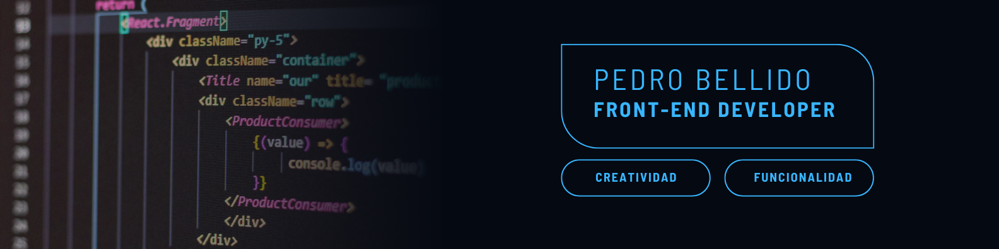

# Como diría kenobi, Hello There! 

### Desarrollador frontend con un enfoque creativo y funcional.
Como diría kenobi, Hello There!

Desarrollador web con un enfoque creativo y funcional. Durante mi trayectoria he adquirido experiencia en Lenguajes como SQL, Css, JavaScript, HTML5. Actualmente estoy profundizando en los lenguajes C++ y Java , en el ámbito del diseño he utilizado programas como Figma,  Adobe Illustrator, Photoshop e InDesign, lo que me ha permitido desarrollar habilidades especializadas en maquetación web, desarrollo de identidades corporativas y optimización de interfaces web.

Mi enfoque resolutivo me ha permitido diseñar y desarrollar tanto entornos web como branding que capturan la esencia y personalidad de cada empresa con la que colaboro. Disfruto del proceso de investigación y experimentación para encontrar soluciones visuales innovadoras.

Ofrezco servicios de desarrollo web, con diseño y creación de aplicaciones web de diferentes sectores para aquellos clientes que desean llevar su negocio al siguiente nivel. Creo que la combinación de elementos gráficos tradicionales con las nuevas tecnologías pueden generar resultados sorprendentes y aumentar el impacto de cualquier proyecto.

La maquetación editorial es otro de los puntos fuertes. Me apasiona crear diseños atractivos y funcionales para libros, revistas y publicaciones digitales. La idea centra en encontrar el equilibrio perfecto entre la estética y la legibilidad, asegurando que el mensaje del contenido se comunique de manera efectiva.

Comprometido en brindar a nuestros clientes un servicio personalizado y de calidad, y como se que todo poder conlleva una gran responsabilidad, entiendo que cada proyecto es único y me esfuerzo por captar la esencia de cada cliente para poder materializar sus ideas y sueños.

Tú buscas llevar tu negocio al siguiente nivel, yo encuentro la manera de hacerlo posible.

Siempre listo para lo que el mundo nos depare!
Excelsior!

## Tecnologías y Lenguajes que suelo utilizar:

- VisualStudioCode
-  HTML
-  CSS
-   JAVASCRIPT

## Programas de edición y diseño que suelo utilizar:

- Figma
- Illustrator
- Indesign
- Photoshop

Linkedln [Pedro Bellido](https://www.linkedin.com/in/pedro-bellido-178915281/)

Siempre listo para lo que el mundo nos depare!
Excelsior!
